# Finityo Site Workflow - Page-by-Page Flowchart with Label IDs

## 🎯 ABSOLUTE GLOBAL ENFORCEMENT RULES

| Rule | Status |
|------|--------|
| Only PG_PLAN may call the engine | ✅ |
| Calendar never recomputes | ✅ |
| Charts never recomputes | ✅ |
| Summary never recomputes | ✅ |
| Compare never overwrites plan | ✅ |
| Lovable Cloud is the ONLY DB | ✅ |

---

## 📊 Mermaid Flowchart Code

```mermaid
graph TB

%% ======================================================
%% CENTRAL DATA + ENGINE RAILS (ISOLATED BACKPLANE)
%% ======================================================

DS_LOVABLE_CLOUD[(DS_LOVABLE_CLOUD<br/>Lovable Cloud DB)]
DS_PLAID[(DS_PLAID<br/>Plaid)]
DS_IMPORT_CSV[(DS_IMPORT_CSV<br/>CSV Import)]
DS_ENGINE[(DS_ENGINE<br/>Internal Engine Cache)]

ENG_COMPUTE_PLAN[ENG_COMPUTE_PLAN]
ENG_APPLY_ONETIME[ENG_APPLY_ONETIME]
ENG_ACCRUE_INTEREST[ENG_ACCRUE_INTEREST]
ENG_GROW_SNOWBALL[ENG_GROW_SNOWBALL]
ENG_COMPARE_STRATEGY[ENG_COMPARE_STRATEGY]

WRITE_USER[WRITE_USER]
WRITE_DEBTS[WRITE_DEBTS]
WRITE_PLAN[WRITE_PLAN]
WRITE_HISTORY[WRITE_HISTORY]

ENG_COMPUTE_PLAN --> DS_ENGINE
DS_ENGINE --> WRITE_PLAN
WRITE_PLAN --> DS_LOVABLE_CLOUD
WRITE_HISTORY --> DS_LOVABLE_CLOUD

%% ======================================================
%% PG_HOME — HERO ROOT ENTRY
%% ======================================================

PG_HOME[PG_HOME]
BTN_HERO_GET_STARTED[BTN_HERO_GET_STARTED]
BTN_HERO_LOGIN[BTN_HERO_LOGIN]
BTN_HERO_GO_DASH[BTN_HERO_GO_DASH]
BTN_HERO_VIEW_COMPARE[BTN_HERO_VIEW_COMPARE]
BTN_HERO_HOW_IT_WORKS[BTN_HERO_HOW_IT_WORKS]

PG_HOME --> BTN_HERO_GET_STARTED --> PG_AUTH
PG_HOME --> BTN_HERO_LOGIN --> PG_AUTH
PG_HOME --> BTN_HERO_GO_DASH --> PG_DASH
PG_HOME --> BTN_HERO_VIEW_COMPARE --> PG_COMPARE
PG_HOME --> BTN_HERO_HOW_IT_WORKS --> PG_SUMMARY

%% ======================================================
%% PG_AUTH — AUTHENTICATION
%% ======================================================

PG_AUTH[PG_AUTH]
BTN_LOGIN[BTN_LOGIN]
BTN_AUTH_SIGNUP[BTN_AUTH_SIGNUP]
BTN_AUTH_LOGOUT[BTN_AUTH_LOGOUT]

PG_AUTH --> BTN_LOGIN --> DS_LOVABLE_CLOUD
BTN_LOGIN --> WRITE_USER --> PG_DASH

PG_AUTH --> BTN_AUTH_SIGNUP --> WRITE_USER --> PG_DASH
BTN_AUTH_LOGOUT --> PG_HOME

%% ======================================================
%% PG_DASH — READ-ONLY HUB
%% ======================================================

PG_DASH[PG_DASH]
BTN_GOTO_DEBTS[BTN_GOTO_DEBTS]
BTN_GOTO_PLAN[BTN_GOTO_PLAN]
BTN_GOTO_CAL[BTN_GOTO_CAL]
BTN_GOTO_CHARTS[BTN_GOTO_CHARTS]

DS_LOVABLE_CLOUD --> PG_DASH

PG_DASH --> BTN_GOTO_DEBTS --> PG_DEBTS
PG_DASH --> BTN_GOTO_PLAN --> PG_PLAN
PG_DASH --> BTN_GOTO_CAL --> PG_CAL
PG_DASH --> BTN_GOTO_CHARTS --> PG_CHARTS

%% ======================================================
%% PG_DEBTS — DATA ENTRY ONLY (NO MATH)
%% ======================================================

PG_DEBTS[PG_DEBTS]
BTN_ADD_DEBT[BTN_ADD_DEBT]
BTN_EDIT_DEBT[BTN_EDIT_DEBT]
BTN_SAVE_DEBT[BTN_SAVE_DEBT]
BTN_DEL_DEBT[BTN_DEL_DEBT]
BTN_IMPORT_CSV[BTN_IMPORT_CSV]
BTN_CONNECT_PLAID[BTN_CONNECT_PLAID]

DS_LOVABLE_CLOUD --> PG_DEBTS
DS_PLAID --> PG_DEBTS
DS_IMPORT_CSV --> PG_DEBTS

PG_DEBTS --> BTN_ADD_DEBT --> PG_DEBTS
PG_DEBTS --> BTN_EDIT_DEBT --> PG_DEBTS
PG_DEBTS --> BTN_SAVE_DEBT --> WRITE_DEBTS --> DS_LOVABLE_CLOUD
PG_DEBTS --> BTN_DEL_DEBT --> DS_LOVABLE_CLOUD
PG_DEBTS --> BTN_IMPORT_CSV --> DS_IMPORT_CSV
PG_DEBTS --> BTN_CONNECT_PLAID --> DS_PLAID

%% ======================================================
%% PG_PLAN — ONLY LEGAL MATH ZONE
%% ======================================================

PG_PLAN[PG_PLAN]
BTN_COMPUTE_PLAN[BTN_COMPUTE_PLAN]
BTN_APPLY_ONETIME[BTN_APPLY_ONETIME]
BTN_CLEAR_PLAN[BTN_CLEAR_PLAN]
BTN_SAVE_PLAN[BTN_SAVE_PLAN]
LOCAL_ONLY_CLEAR[LOCAL_ONLY_CLEAR]

DS_LOVABLE_CLOUD --> PG_PLAN
DS_PLAID --> PG_PLAN
DS_IMPORT_CSV --> PG_PLAN

PG_PLAN --> BTN_COMPUTE_PLAN --> ENG_COMPUTE_PLAN
PG_PLAN --> BTN_APPLY_ONETIME --> ENG_APPLY_ONETIME

ENG_COMPUTE_PLAN --> ENG_APPLY_ONETIME
ENG_COMPUTE_PLAN --> ENG_ACCRUE_INTEREST
ENG_COMPUTE_PLAN --> ENG_GROW_SNOWBALL

PG_PLAN --> BTN_SAVE_PLAN --> WRITE_PLAN
PG_PLAN --> BTN_SAVE_PLAN --> WRITE_HISTORY

PG_PLAN --> BTN_CLEAR_PLAN --> LOCAL_ONLY_CLEAR --> PG_PLAN

%% ======================================================
%% PG_CAL — READ ONLY MIRROR
%% ======================================================

PG_CAL[PG_CAL]
DS_LOVABLE_CLOUD --> PG_CAL

%% ======================================================
%% PG_CHARTS — READ ONLY MIRROR
%% ======================================================

PG_CHARTS[PG_CHARTS]
DS_LOVABLE_CLOUD --> PG_CHARTS

%% ======================================================
%% PG_SUMMARY — READ ONLY TOTALS
%% ======================================================

PG_SUMMARY[PG_SUMMARY]
BTN_EXPORT_SUMMARY[BTN_EXPORT_SUMMARY]
BTN_SHARE_SUMMARY[BTN_SHARE_SUMMARY]

DS_LOVABLE_CLOUD --> PG_SUMMARY
PG_SUMMARY --> BTN_EXPORT_SUMMARY
PG_SUMMARY --> BTN_SHARE_SUMMARY --> PG_SHARE

%% ======================================================
%% PG_COMPARE — SANDBOX ONLY
%% ======================================================

PG_COMPARE[PG_COMPARE]
BTN_RUN_COMPARE[BTN_RUN_COMPARE]

PG_COMPARE --> BTN_RUN_COMPARE --> ENG_COMPARE_STRATEGY
ENG_COMPARE_STRATEGY --> PG_COMPARE

%% ======================================================
%% PG_SETTINGS — PREFERENCES ONLY
%% ======================================================

PG_SETTINGS[PG_SETTINGS]
BTN_TOGGLE_THEME[BTN_TOGGLE_THEME]
BTN_SET_CURRENCY[BTN_SET_CURRENCY]
BTN_SET_DEFAULT_STRATEGY[BTN_SET_DEFAULT_STRATEGY]

PG_SETTINGS --> BTN_TOGGLE_THEME --> DS_LOVABLE_CLOUD
PG_SETTINGS --> BTN_SET_CURRENCY --> DS_LOVABLE_CLOUD
PG_SETTINGS --> BTN_SET_DEFAULT_STRATEGY --> DS_LOVABLE_CLOUD

%% ======================================================
%% PG_SHARE — STORED DATA ONLY
%% ======================================================

PG_SHARE[PG_SHARE]
BTN_GENERATE_CARD[BTN_GENERATE_CARD]
BTN_COPY_LINK[BTN_COPY_LINK]

DS_LOVABLE_CLOUD --> PG_SHARE
PG_SHARE --> BTN_GENERATE_CARD
PG_SHARE --> BTN_COPY_LINK

%% ======================================================
%% GLOBAL FOOTER NAVIGATION BUS
%% ======================================================

FT_LINK_HOME[FT_LINK_HOME]
FT_LINK_DASH[FT_LINK_DASH]
FT_LINK_DEBTS[FT_LINK_DEBTS]
FT_LINK_PLAN[FT_LINK_PLAN]
FT_LINK_CAL[FT_LINK_CAL]
FT_LINK_COMPARE[FT_LINK_COMPARE]
FT_LINK_SETTINGS[FT_LINK_SETTINGS]
FT_LINK_SHARE[FT_LINK_SHARE]

FT_LINK_HOME --> PG_HOME
FT_LINK_DASH --> PG_DASH
FT_LINK_DEBTS --> PG_DEBTS
FT_LINK_PLAN --> PG_PLAN
FT_LINK_CAL --> PG_CAL
FT_LINK_COMPARE --> PG_COMPARE
FT_LINK_SETTINGS --> PG_SETTINGS
FT_LINK_SHARE --> PG_SHARE

%% ======================================================
%% STYLING
%% ======================================================
classDef homePage fill:#fff9c4,stroke:#f57f17,stroke-width:2px
classDef authPage fill:#e1f5ff,stroke:#0288d1,stroke-width:2px
classDef mathPage fill:#ffebee,stroke:#c62828,stroke-width:3px
classDef readPage fill:#e8f5e9,stroke:#388e3c,stroke-width:2px
classDef engine fill:#fff3e0,stroke:#f57c00,stroke-width:2px
classDef dataSource fill:#f3e5f5,stroke:#7b1fa2,stroke-width:2px
classDef button fill:#e3f2fd,stroke:#1976d2,stroke-width:1px
classDef write fill:#fce4ec,stroke:#c2185b,stroke-width:2px
classDef footerNav fill:#e0f2f1,stroke:#00897b,stroke-width:1px

class PG_HOME homePage
class PG_AUTH authPage
class PG_PLAN mathPage
class PG_CAL,PG_CHARTS,PG_SUMMARY,PG_SHARE readPage
class PG_DASH,PG_DEBTS,PG_COMPARE,PG_SETTINGS authPage
class ENG_COMPUTE_PLAN,ENG_APPLY_ONETIME,ENG_ACCRUE_INTEREST,ENG_GROW_SNOWBALL,ENG_COMPARE_STRATEGY engine
class DS_LOVABLE_CLOUD,DS_PLAID,DS_IMPORT_CSV,DS_ENGINE dataSource
class WRITE_USER,WRITE_DEBTS,WRITE_PLAN,WRITE_HISTORY write
class FT_LINK_HOME,FT_LINK_DASH,FT_LINK_DEBTS,FT_LINK_PLAN,FT_LINK_CAL,FT_LINK_COMPARE,FT_LINK_SETTINGS,FT_LINK_SHARE footerNav
```

---

## 🎨 Color Legend

- **Yellow (Home Page)**: PG_HOME - Hero/Landing root entry point
- **Blue (Auth Pages)**: PG_AUTH, PG_DASH, PG_DEBTS, PG_COMPARE, PG_SETTINGS
- **Red (Math Zone)**: PG_PLAN - THE ONLY PAGE THAT CALLS ENGINE
- **Green (Read-Only)**: PG_CAL, PG_CHARTS, PG_SUMMARY, PG_SHARE
- **Orange (Engines)**: ENG_COMPUTE_PLAN, ENG_APPLY_ONETIME, ENG_ACCRUE_INTEREST, ENG_GROW_SNOWBALL, ENG_COMPARE_STRATEGY
- **Purple (Data Sources)**: DS_LOVABLE_CLOUD, DS_PLAID, DS_IMPORT_CSV, DS_ENGINE
- **Pink (Write Operations)**: WRITE_USER, WRITE_DEBTS, WRITE_PLAN, WRITE_HISTORY
- **Teal (Footer Navigation)**: FT_LINK_* global navigation bus

---

## 📥 How to Convert to PDF

1. Copy the Mermaid code above
2. Visit https://mermaid.live/
3. Paste the code
4. Click "Actions" → "Export as PNG/SVG/PDF"
5. Save your visual flowchart

Alternatively, use VS Code with Mermaid extension or command-line tools like `mmdc` (Mermaid CLI).
